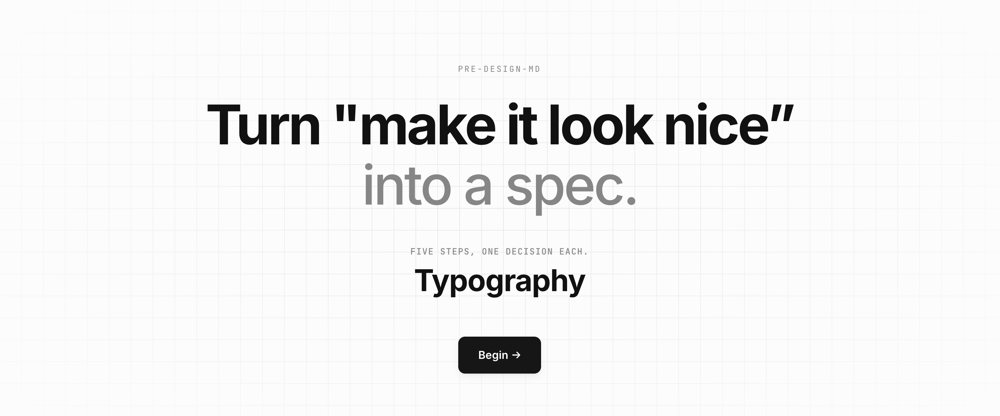

# pre-design-md

> Decide your design tokens visually. Export as DESIGN.md, AI prompt, or CSS.

<p align="center">
  
</p>

## The problem

AI coding has a harness. Type checkers, linters, tests, CI — they put autonomy inside boundaries. Output is always judged mechanically, which is why it's repeatable, which is why it's reproducible.

Design doesn't have one. The same prompt produces different results, and "does this look good" can't be judged the way "does this typecheck" can. So design stays in the vibe phase while the rest of the pipeline tightens.

The paradox: a design system *is* a harness. Tokens, spacing rules, component definitions — every line is "this much freedom, no further." But that harness rarely connects to the AI coding pipeline. Humans build design systems and hope AI reads them. The wiring is what's missing.

## What this is

A tool that produces the input to your AI coding agent, not the output.

You make five structural decisions visually (typography → spacing → radius → shadow → color). The app turns those decisions into a prompt that Claude Code, Cursor, or Codex can read and reproduce consistently. The artifact isn't code — it's **intent + values**, paired so the agent has both the rationale and the numbers.

## What this isn't

- Not a design system builder. If you need Figma Tokens or Style Dictionary, use those.
- Not another theme builder. A theme builder outputs CSS. This outputs context for an LLM.
- Not a component library. There's nothing to install in your project.

## How it works

Five steps, base decisions only. Each step asks for the one or two foundational choices; everything else is derived. Pick a base size and ratio for typography, and the full type scale is generated. Pick a primary hue, and interaction states (hover/focus/active/disabled) follow automatically.

The order is bones → form → surface → mood:

1. **Typography** — base size, ratio, font pairing
2. **Spacing** — base unit, scale type
3. **Radius** — base, scale
4. **Shadow** — intensity, tinting
5. **Color** — primary hue, chroma, neutral style, dark mode

You preview each decision applied to real components, not abstract swatches.

## Three exports

| Tab | When to use |
|-----|-------------|
| **Google DESIGN.md** | Spec compatibility with Google's official `DESIGN.md` format. Lint-passing, hex colors. |
| **Rich Prompt** | When you want the AI to know *why*. Includes OKLCH values and per-decision rationale. |
| **CSS Variables** | Tokens only, no prose. |

Default is Google DESIGN.md. The Rich Prompt is where this tool's actual value lives — it's designed for an AI agent to read and reason from, not just paste.

## Quick start

```bash
git clone https://github.com/<you>/pre-design-md
cd pre-design-md
npm install
npm run dev
```

Make your decisions, copy the export, paste it into your AI coding agent's context (a `DESIGN.md` at the repo root works for most agents). That's it.

## Design decisions

A few choices worth flagging — fuller writeup in the accompanying Zenn post.

- **No Tailwind.** The app injects design tokens at runtime. Tailwind's compile-time class generation fights that, and using a styling system that disagrees with the tool's own subject matter felt wrong.
- **`lib/` doesn't know React.** All scale generation, palette math, and prompt building lives in pure functions. The UI calls into them; they don't call back. Testable, and the same logic can move to a CLI later if needed.
- **Store holds decisions, not derived values.** Five base choices live in Zustand. Type scales, palettes, shadows — all recomputed via selectors with `useMemo`. No drift between "what the user picked" and "what's rendered."
- **No UI library.** Building a tool *about* design system consistency on top of someone else's components would be ironic. Every preview component is hand-built so the tokens actually get exercised.

## License

Apache License 2.0. See [LICENSE](./LICENSE).